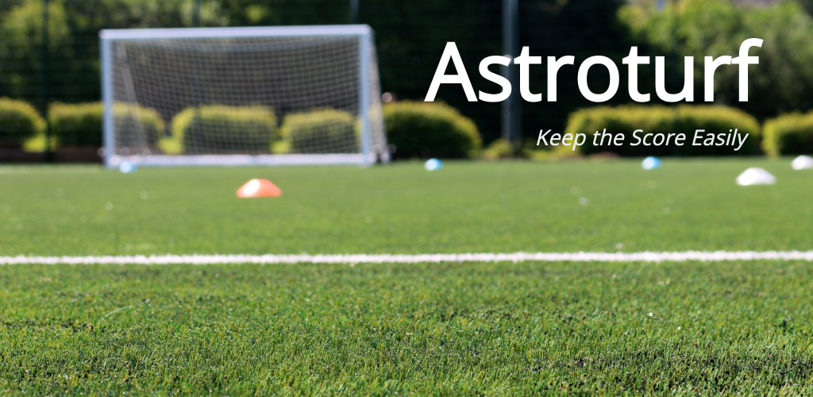

# Astroturf

Are you having a hard time keeping the score while playing astroturf football with your friends?

No more! You'll be able to keep the score easily with this super simple Android Wear application.

Highlights:
* Haptic feedback with vibration
* 60 minutes long matches
* Notification to change goal keeper every 10 minutes

Astroturf is open sourced, see [LICENSE.md](LICENSE.md).

## References
* Application icon is from https://www.svgrepo.com/svg/261659/scoreboard licensed with Creative Commons BY 4.0
* Feature graphic background is from [Photo by Mat Brown from Pexels](https://www.pexels.com/photo/astro-turf-cones-field-football-1084467)
* Play Store feature graphics are generated by https://www.norio.be/android-feature-graphic-generator
